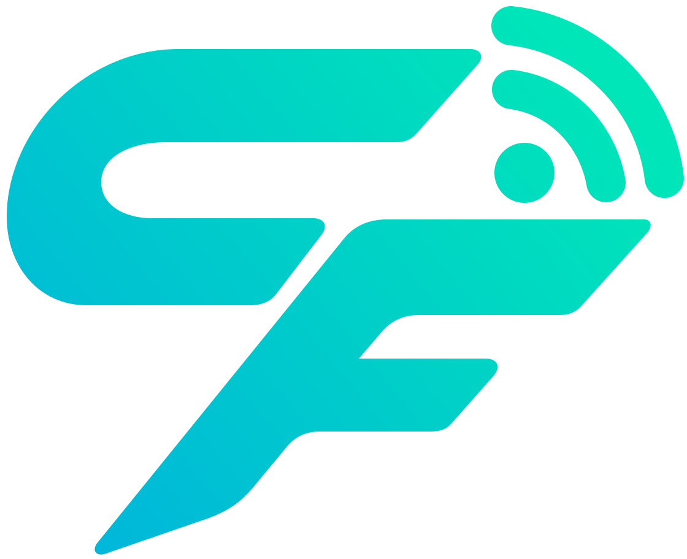
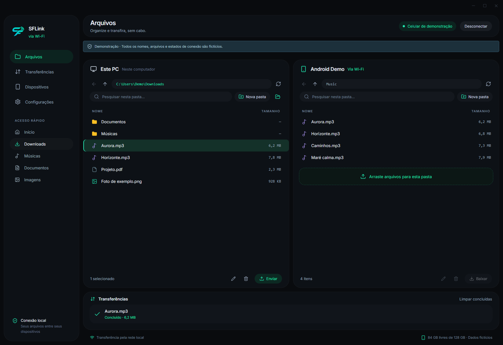
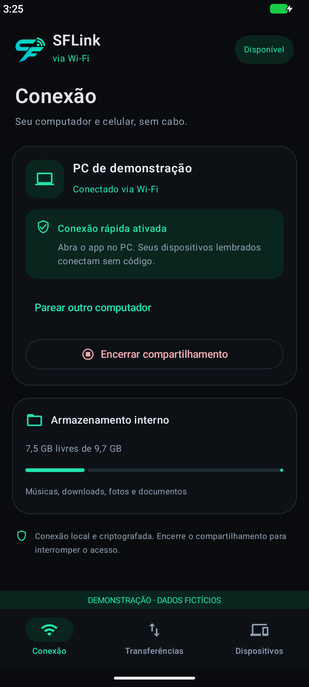

# SFLink

Gerenciador de arquivos entre Windows e Android pela rede Wi-Fi. Explore as pastas do computador e do celular em uma única janela e envie arquivos arrastando para o painel do Android.

- Desktop em Tauri 2, Svelte e Rust; Android nativo em Kotlin/Compose.
- Envio e download em streaming, fila, progresso e cancelamento.
- Navegação, busca, criação de pastas, renomeação e exclusão. Arquivos existentes não são substituídos automaticamente.
- Primeiro pareamento por IP e código, com autorização e conferência no celular.
- “Lembrar dispositivo” autoriza reconexão sem repetir o código. Revogação disponível no Android.
- Atualizador pelo GitHub Releases, com conferência de tamanho/SHA-256 e confirmação de instalação.

Desktop: **0.3.1** · Android: **0.3.0**. [Baixe a release desktop](https://github.com/NskBR/SFLink-APP/releases/tag/v0.3.1) ou o [APK Android 0.3.0](https://github.com/NskBR/SFLink-APP/releases/tag/v0.3.0). Os aparelhos precisam estar na mesma rede local; isolamento de clientes/broadcast bloqueado pode impedir descoberta ou conexão. Não há acesso às pastas privadas de outros apps Android.

## Capturas de demonstração

As capturas usam nomes, arquivos e conexão fictícios, sem credenciais ou arquivos do usuário. A tela Android foi renderizada no emulador; sua capacidade de armazenamento é a do ambiente de demonstração. As capturas mostram a interface, não uma transferência real.

## Executar e compilar

Windows: instale Node.js, Rust e as ferramentas de compilação do Tauri para Windows. Em `desktop/`, execute `npm ci` e `npm run desktop`. Para gerar executável/instalador: `npm run desktop:build`.

Android: abra `android/` no Android Studio, configure o SDK localmente e sincronize o Gradle. Requer Android 11 ou superior. O usuário precisa autorizar acesso aos arquivos no celular. Para um APK de teste: `gradlew.bat :app:assemblePreview`. Preview usa assinatura de desenvolvimento.

Para produção e atualização Android, configure uma chave privada estável fora do Git. Consulte o [guia de atualização e assinatura](desktop/docs/updates.md). Os binários ficam nos assets da release; nenhum material de assinatura integra o repositório-fonte. Se você usa um APK preview anterior, leia a orientação de migração na release: a assinatura de produção é diferente e exige uma primeira reinstalação/novo pareamento.

## Testes e documentação

- Desktop: `npm run build` e `cargo test --lib` em `desktop/src-tauri/`.
- Android: `gradlew.bat :app:testDebugUnitTest :app:lintPreview`.
- Integração Android: `RememberedConnectionTest`, com emulador/dispositivo de teste. Os testes Rust que exigem pareamento manual são ignorados por padrão.
- [Contrato PC ↔ Android](desktop/docs/android-api.md).
- [Modelo de segurança e revisão dos arquivos](SECURITY.md).
- [Validação desta versão](docs/validation.md).

Para reproduzir a captura desktop, execute o Vite em `desktop/` e abra `/docs-preview.html`; essa entrada usa componentes reais com dados fixos e não integra o build principal. A captura Android é gerada pelo teste `DemoScreenshotTest` em `android/app/src/androidTest/`; a fixture não abre servidor nem grava autorização real.

## Builds de distribuição

Os builds são locais, sem GitHub Actions. O script `tools/build-release.ps1` usa as variáveis de assinatura documentadas e gera os arquivos em `artifacts/` (ignorado pelo Git), incluindo `SHA256SUMS.txt`. A publicação dos assets é uma etapa separada.
